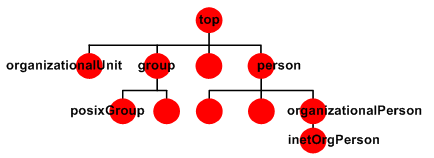

## LDAP Object Classes

Each object in an LDAP directory has at least one object class associated with it. The object class determines the characteristics of this object, in particular the set of attributes which the object can have (and the ones it must have).

The object classes are defined in the LDAP directory schema - they constitute a class hierarchy there, there is one central top level class (which is called 'top'), all other classes are derived from that.



## LDAP Entries

An LDAP entry is a collection of information about an entity. Each entry consists of three primary components: 
* a distinguished name (DN): 
* a collection of attributes
* a collection of object classes. Each of these is described in more detail below. 


### DN
An entry’s distinguished name, often referred to as a DN, uniquely identifies that entry and its position in the `directory information tree` (DIT) hierarchy. The DN of an LDAP entry is much like the path to a file on a filesystem.
it is comprised of 0/N `Relative Distinguish Names` (RDN) of type `key=value`.
An entry with a `null DN` is a special type of entry called the `root DSE` which provides information about the content and capabilities of the directory server. 
For DNs with multiple RDNs, the order of the RDNs specifies the position of the associated entry in the DIT. RDNs are separated by commas, and each RDN in a DN represents a level in the hierarchy in descending order (i.e., moving closer to the root of the tree, which is called the naming context). That is, if you remove an RDN from a DN, you get the DN of the entry considered the parent of the former DN. For example, the DN `uid=john.doe,ou=People,dc=example,dc=com` has four RDNs, with the parent DN being `ou=People,dc=example,dc=com`. 

### Attributes

Attributes hold the data for an entry. Each attribute has an attribute type, zero or more attribute options, and a set of values that comprise the actual data.

Attribute types are schema elements that specify how attributes should be treated by LDAP clients and servers. All attribute types must have an object identifier (OID) and zero or more names that can be used to reference attributes of that type

### Object Classes

Object classes are schema elements that specify collections of attribute types that may be related to a particular type of object, process, or other entity


### Object Identifiers (OIDs)

An object identifier (OID) is a string that is used to uniquely identify various elements in the LDAP protocol, as well as in other areas throughout computing. OIDs consist of a sequence of numbers separated by periods (e.g., `1.2.840.113556.1.4.473` is the OID that represents the server-side sort request control


#### String  X.500 AttributeType

| Attribute  | Description |
| ------------- | ------------- |
| DC | domainComponent |
| OU | organizationalUnitName
| CN | commonName |
| UID | userid |
| L | localityName |
| ST | stateOrProvinceName |
| O | organizationName |
| C | countryName |
| STREET | streetAddress |


## Terraform provider for LDAP

#### Terraform main manifest
```sh
resource "ldap_object" "a123456" {
	dn					= "uid=a123456,${ldap_object.users_example_com.dn}"		
	object_classes		= ["inetOrgPerson", "posixAccount"]
	attributes			= [		
		{ sn			= "Doe"}, 		
		{ givenName		= "John"},
		{ cn			= "John Doe"},
		{ displayName	= "Mr. John K. Doe, esq."},
		{ mail 			= "john.doe@example.com" },
		{ mail			= "a123456@internal.example.com" },
		{ userPassword  = "password" },
		{ uidNumber		= "1234" },
		{ gidNumber		= "1234" },
		{ homeDirectory	= "/home/jdoe"},
		{ loginShell	= "/bin/bash" }
	]
}
```